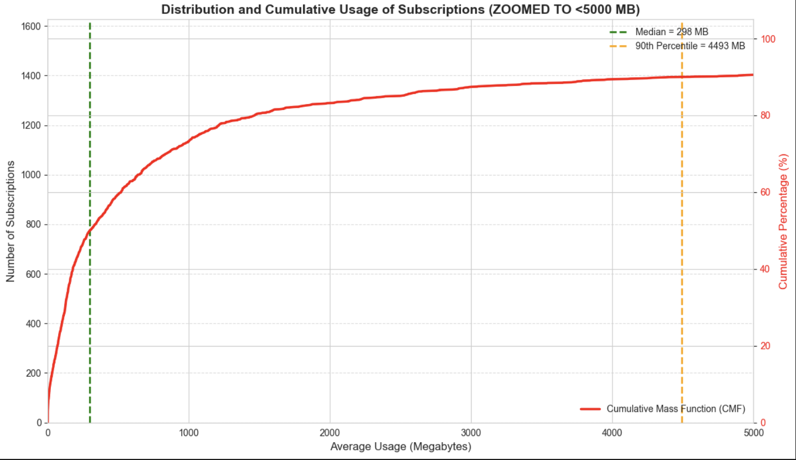
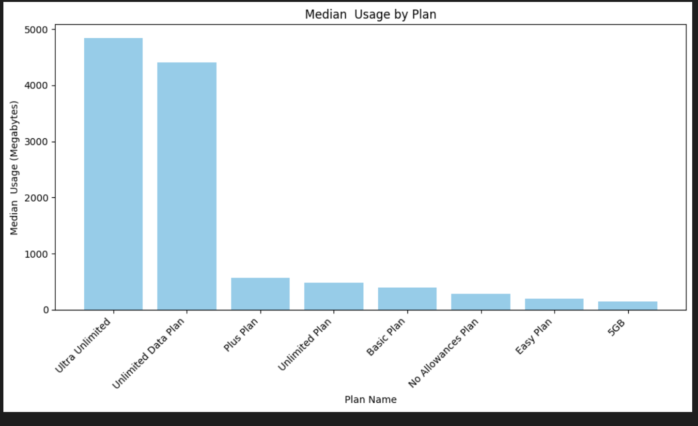
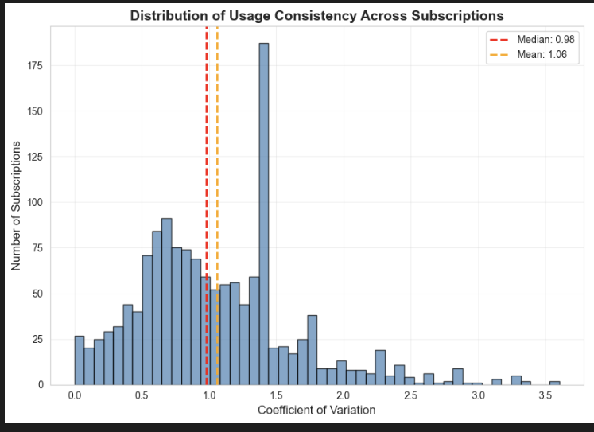
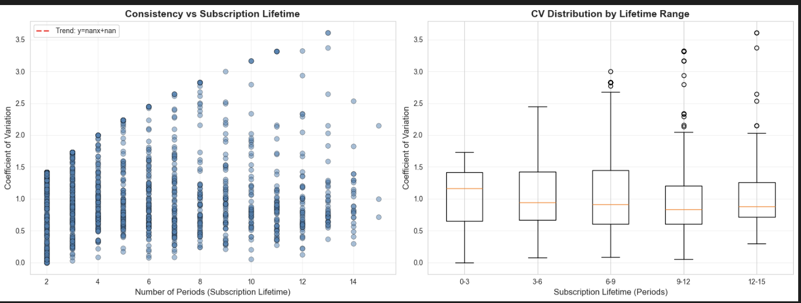
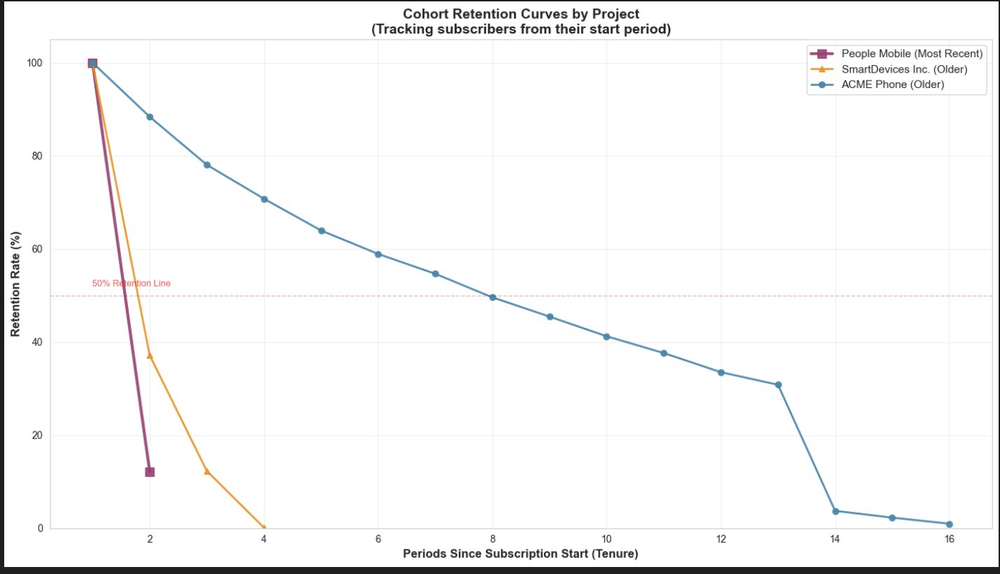

Dear [stakeholder name],

Here are the key Insights regarding your questions:

1️⃣ Typical Data Consumption:

Median usage: ~298 MB per subscription period
High variability across customers (many low-usage + some power users)
80% of subscriptions consume less than ~1,000 MB

**NB : Please note that the picture is zoomed due to the outliers.**

2️⃣ Usage by Plan Type

The Unlimited/Ultra Unlimited plans drive significantly higher consumption.

The Network provider has no measurable effect on usage patterns. There is a clear correlation between plan allowances and actual usage.

_>>More in depth investigations can be done in this subject.<<_

3️⃣ Usage Consistency

The consistency is measured by our consistency KPI: coefficient of variation (CV).
I found that the CV is Moderately consistent overall (CV = 0.98)
Furthermore, 43% of subscriptions show consistent usage patterns (CV ≤ 1)
Also, usage becomes MORE consistent over time as subscriptions mature

Here is a better graph through time:

Notice how the majority of the subscriptions become more consistent over time (excluding the outliers, the points outside the boxes - roight graph -).

4️⃣ ⚠️ Retention Red Flag

ACME Phone (newest project) shows significantly lower retention vs older projects
People Mobile & SmartDevices Inc. maintain 50%+ retention at period 16
ACME Phone drops faster, suggesting underlying issues

Acme is the only project that shows high retention, while the others loose an increible amount ofclients in the first period.

🚨 Recommended Actions:

1. Investigate ACME Phone retention drop - conduct user surveys, review pricing/features vs competitors
2. Check for technical issues (service quality, outages, speed)
3. Analyze customer support metrics and complaint trends
4. Consider promotional strategies that worked for older projects
5. Consider adding the financial perspective.

Let me know if you would like me to dig deeper into any specific area.
