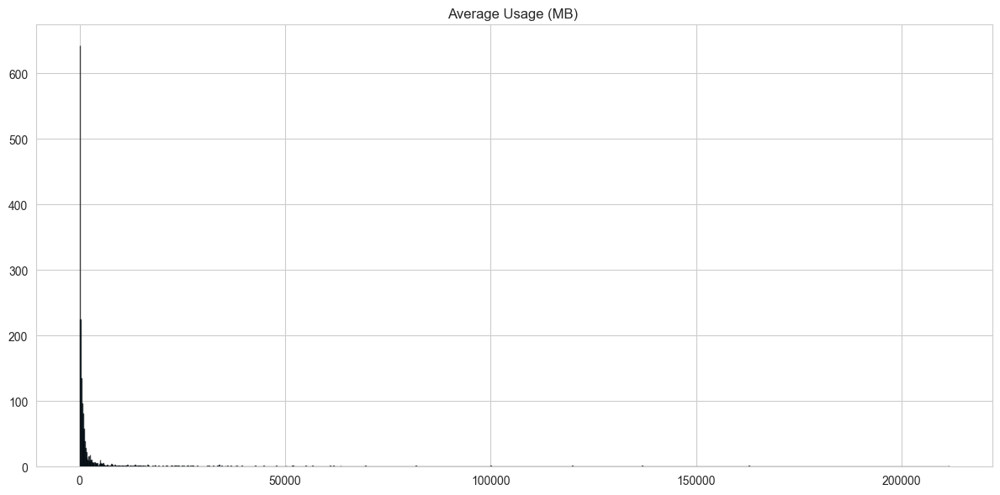
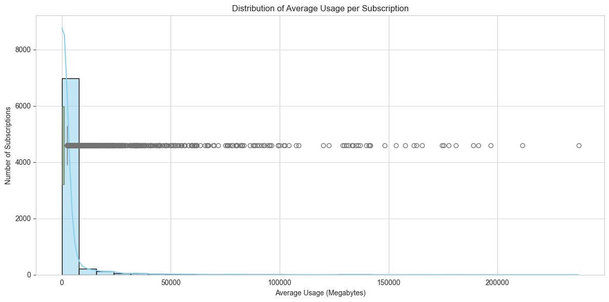

Dear [stakeholder name],

Here are the key Insights regarding your questions:

1️⃣ **How much data does a subscription typically consume?**

Typical Data Consumption depends on the granularity, here is at a global view:

- Median usage: ~250 MB per subscription period ( more insights about this in the next questions)
- High spread on usage across customers (many low-usage + and some power users)
- Almost 75% of subscriptions consume less than ~1,000 MB (see the **yellow** doted line )

<table>
  <tr>
    <td></td>
    <td></td>
    <td></td>
  </tr>
</table>

At left the we can see the vast amount of users that dont consume much.
At middle the cumulative percentage that it represents, as you can see almost 75% consume less than 1gb
The right graph (for more stats people) shows the big amount of outliers present.

2️⃣ **How does usage look like at different plan data allowances?**

The Usage by Plan Type is significantly different among plans; Ultra Unlimited plans drive significantly higher consumption.
There is a clear correlation between plan allowances and actual usage.

_>>More in depth investigations can be done in this subject. For example the influence of netwrok provider in consumption (is there tech issues?).<<_

3️⃣ **Do subscriptions typically consume consistent amounts of data throughout their lifetime?**

The usage consistency is can be measured by a consistency metric: coefficient of variation (CV).
I found that the CV is Moderately consistent overall (CV = 0.98) (better view on the graph bellow)
Furthermore, 50% of subscriptions show consistent usage patterns (CV ≤ 1)

Here a graph throughout time:

**Right graph**: _Notice how the majority of the subscriptions stay consistent over time (excluding the outliers, that are more visible later, the points outside the boxes)._

4️⃣ **Compare the retention pattern for the most recently launched project versus the two older ones.**

**_Retention_:**  
Here we can see a big difference between projects.
ACME Phone (newest project) shows significantly lower retention vs older projects
People Mobile & SmartDevices Inc. loose more than 50% of users in the second period!.
ACME Phone drops at period 13, suggesting underlying issues.

Acme is the only project that shows high retention, while the others loose an increible amount ofclients in the first period.

🚨 Recommended Actions:

1. Its HIGHLY advisable to study the monetary side, ACME project could have higher retention but if the money side is close to zero then it addresses another niche.
1. Investigate if users churn due internal issues or due to influence from outside the company (also due to promotions, adversaries etc.).
1. Investigate why ACME Phone retention drop on 14th period- conduct user surveys, review pricing/features vs competitors
1. Check for technical issues (service quality, outages, speed, payment, etc)
1. Analyze customer support metrics and complaint trends
1. Consider promotional strategies that worked for older projects
1. Consider adding the financial perspective of promotions in long term.

Let me know if you would like me to dig deeper into any specific area.
